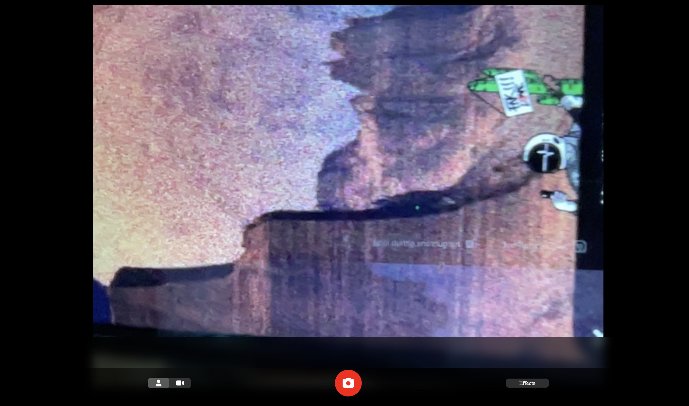

# PhotoBooth

A basic camera app which clones the UI of the MacOS PhotoBooth App with video recording and image capturing along with Color Filters.

## Features

-   Light/dark mode toggle
-   Image capturing
-   Video Recording
-   Gallery options
-   Color Filters

## Screenshots

<!-- 
 -->

